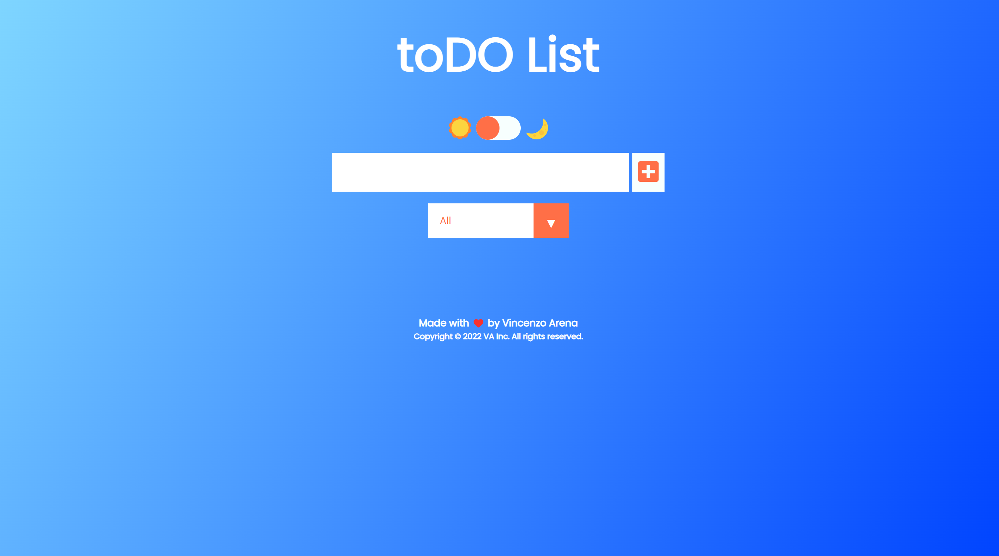
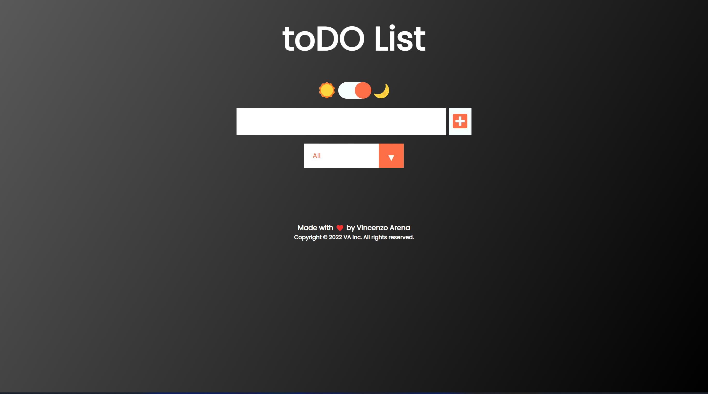

# toDo List App

**[Test this app yourself](https://vincenzoarena.github.io/to-do-list-app/)**

---
### Light Mode

### Dark Mode

---

### About Project

This prototype App is a toDo List created using HTML, CSS, and JavaScript. This prototype has also a switch to go from the Light to the Dark Mode.

### How to use this Project

Would you like to have a list of activities to do, or task to accomplish? Use my toDO List App! Enter your activities and save them by clicing on the "+" to add them to the list. Check them out after having them accomplished and then trash them once they are done. You can also choose if display:

- all the tasks;
- all the completed tasks;
- all the uncompleted task.

You can use this App both in Light and in Dark Mode. Switching between the two modes it is very easy, you just have to click on the sliding toggle.

##### Developed With

- [x] _HTML5_
- [x] _CSS3_
- [ ] _SASS_
- [ ] _SCSS_
- [x] _JavaScript_
- [ ] _React_
- [ ] _Bootstrap_
- [ ] _npm_
- [ ] _..._

---

### Contact

Mail: <penninoematita@gmail.com> 
GitHub: [vincenzoarena](https://github.com/vincenzoarena) 
LinkedIn: [Vincenzo Arena](https://www.linkedin.com/in/vincenzo-arena-032a064b/)

---

### Used Tools

- [icons](https://)
- [Canva](https://www.canva.com/)
- [npm](https://www.npmjs.com/)
- [Google Fonts](https://fonts.google.com/)
- [Visual Studio Code](https://code.visualstudio.com/)
- [ColorZilla](https://www.colorzilla.com/chrome/)

---